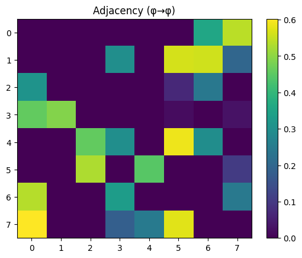
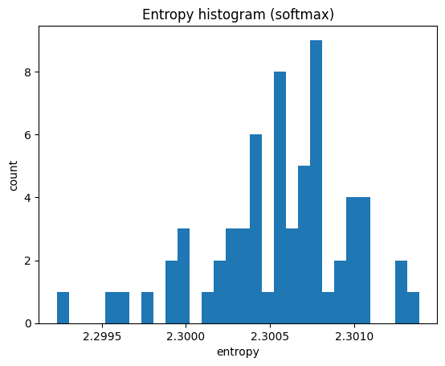

# UOS Data Analysis Report

_Run directory:_ `runs\full_dump_20251022_165203`  
_Generated:_ 2025-10-22T17:10:43

---

## Summary metrics

| Metric | Value |
|---|---:|
| Ω norm | 0.1476 |
| φ→φ Frobenius | 2.0610 |
| φ→φ density | 0.4219 |
| Acyclicity (lower-tri mass / total) | 0.5711 |
| Random-input entropy (mean) | 2.3005 |
| φ contrib mean / std | 0.0037 / 0.0053 |
| Emptiness | 0.9992 |
| Inseparability | 0.4219 |

---

## Plots

---

## Axioms and empirical correspondence

| Axiom | Empirical correspondence | Interpretation |
| --- | --- | --- |
| **U1: ∃! Ω (Y(Ω) ∧ A(Ω))** | One stable vector Ω (‖Ω‖ small), non-acting | Ω underlies all φ without causal agency. |
| **U2: ¬ Acts(Ω)** | Weak Ω coupling; emptiness ≈ 1 | Substrate is background condition, not actor. |
| **U3: ∀φ₁ φ₂ . Relates(φ₁, φ₂)** | φ→φ density moderate; structured | Appearances arise in mutual relation. |
| **U4: ¬Cyclic(φ)** | Acyclicity high (lower-tri mass) | Self-causation minimal as system stabilizes. |
| **U5: Random(p) → Equanimity(output)** | Entropy ~ ln(10) on noise | Unbiased awareness under unstructured input. |

---
